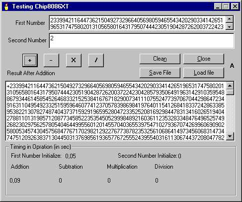



## chip8086XT\-V1

### Description

Able to do mathematical operation of very long numbers (exp. more than 50 000 digits) and keep the accuracy...
 
### More Info
 
string/numbers

             |
---                |---
**Submitted On**   |2002-07-01 14:11:40
**By**             |[Deepak Kumar Shaw](https://github.com/Planet-Source-Code/PSCIndex/blob/master/ByAuthor/deepak-kumar-shaw.md)
**Level**          |Advanced
**User Rating**    |5.0 (15 globes from 3 users)
**Compatibility**  |VB 4\.0 \(32\-bit\), VB 5\.0, VB 6\.0, ASP \(Active Server Pages\) , VBA MS Access, VBA MS Excel
**Category**       |[Math/ Dates](https://github.com/Planet-Source-Code/PSCIndex/blob/master/ByCategory/math-dates__1-37.md)
**World**          |[Visual Basic](https://github.com/Planet-Source-Code/PSCIndex/blob/master/ByWorld/visual-basic.md)
**Archive File**   |[chip8086XT1206478212002\.zip](https://github.com/Planet-Source-Code/deepak-kumar-shaw-chip8086xt-v1__1-38146/archive/master.zip)

